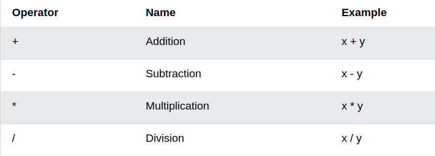

<div id="top"></div>
<!--
*** Thanks for checking out the Best-README-Template. If you have a suggestion
*** that would make this better, please fork the repo and create a pull request
*** or simply open an issue with the tag "enhancement".
*** Don't forget to give the project a star!
*** Thanks again! Now go create something AMAZING! :D
-->


<!-- PROJECT SHIELDS -->
<!--
*** I'm using markdown "reference style" links for readability.
*** Reference links are enclosed in brackets [ ] instead of parentheses ( ).
*** See the bottom of this document for the declaration of the reference variables
*** for contributors-url, forks-url, etc. This is an optional, concise syntax you may use.
*** https://www.markdownguide.org/basic-syntax/#reference-style-links
-->

<!-- PROJECT LOGO -->
<br />
<div align="center">
    
</div>

<h1 align="center">Förderwochenkurs Python</h1>

  
<!-- TABLE OF CONTENTS -->
<details>
  <summary>Kapitel</summary>
  <a href="#about-the-project">About The Project</a>
  <ol>     
    <li><a href="#dt">Data Types</a></li>
    <li><a href="#print">Print</a></li>
    <li><a href="#operanden">Operanden</a></li>
    <li><a href="#if-else">If-Else</a></li>
    <li><a href="#random">Random</a></li>
    <li><a href="#while-for">While For</a></li>
    <li><a href="#ds">Data Structures</a></li>
    <li><a href="#fstrings">f'Strings</a></li>
    <li><a href="#funktionen">Funktionen</a></li>
  </ol>
  <li><a href="#projects">Mini Projects</a></li>
</details>
    
    
<!-- ABOUT THE PROJECT -->

<h2 id="about-the-project">About The Project</h2>
Lorem ipsum dolor sit amet, consetetur sadipscing elitr, sed diam nonumy eirmod tempor invidunt ut labore et dolore magna aliquyam erat, sed diam voluptua. At vero eos et accusam et justo duo dolores et ea rebum. Stet clita kasd gubergren, no sea takimata sanctus est Lorem ipsum dolor sit amet. Lorem ipsum dolor sit amet, consetetur sadipscing elitr, sed diam nonumy eirmod tempor invidunt ut labore et dolore magna aliquyam erat, sed diam voluptua. At vero eos et accusam et justo duo dolores et ea rebum. Stet clita kasd gubergren, no sea takimata sanctus est Lorem ipsum dolor sit amet.
<!-- Data Type -->

<h2 id="dt">Data Types</h2>

In Python gibt es folgende Datentypen:

* String --> "Hallo" (Wichtig: Alles zwischen zwei Anführungszeichen ist ein String, also auch "4" oder "4.0"
* Int --> 4
* Float --> 4.0
* Bool --> True/False

Hinweis: Mit der `type()` Funktion kann der Datentyp auch manuell herausgefunden werden<br>
<p>print(type("Hallo"))</p>
<pre><'class string'></pre>


<!-- Print -->
<h2 id="print">Print</h2>
Mit der <code>print()</code> Funktion kann man in Python Werte im Terminal ausgeben lassen. <br>
Die Print-Funktion akzeptiert jeden Datentyp, jedoch dürfen verschiedene Datentypen nicht einfach so gemischt werden. Lösungen für dieses Problem sind entweder die String-Addition oder sogenannte <a href="#fstrings">f-Strings</a>, auf welche wir später eingehen werden.
`
<!-- Operanden -->
<h2 id="operanden">Operanden</h2>
Die gängigsten Operatoren in Python sind:

<figcaption class="caption">Quelle: W3Schools</figcaption>
<h3>String-Addition</h3>
Auch Strings können mit dem <code>+</code> Operator zusammengefügt werden.<br>
Addiert man jedoch zwei verschiedene Datentypen miteinander(z.B "Hallo" + 4), wird ein Fehler angezeigt.<br>
Um diesen Fehler zu beheben muss man die Zahl in einen String-Wert umwandeln. Dies geht mit der <code>str()</code> Funktion.<br>
<code>str(4)</code> --> <code>"4"</code>

<!-- If-else -->
<h2 id="if-else">If-Else</h2>
Mit sogenannten "if-statements" kann man in Python eine Bedingung an die Ausführung eines Codes knüpfen.<br>
Dafür stehen einen folgende Vergleichsoperatoren zur verfügung:
* Gleichheit: <code>a == b</code>
* Ungleichheit: <code>a != b</code>
* Größer als: <code>a > b</code>
* Größer-Gleich: <code>a >= b</code>
* Kleiner als: <code>a < b</code>
* Kleiner-Gleich: <code>a <= b</code>

<p>Syntax: Bei if-statements wird die Bedingung, beendet mit einem <code>:</code>, normal angeschrieben.<br>
Der Teil, welcher nur unter der Bedingung ausgeführt werden soll, wird eingerückt.
</p>
```python
if a == b:
    print("a und b sind gleich")
```

<!-- Random -->
<h2 id="random">Random</h2>
Lorem ipsum dolor sit amet, consetetur sadipscing elitr, sed diam nonumy eirmod tempor invidunt ut labore et dolore magna aliquyam erat, sed diam voluptua. At vero eos et accusam et justo duo dolores et ea rebum. Stet clita kasd gubergren, no sea takimata sanctus est Lorem ipsum dolor sit amet. Lorem ipsum dolor sit amet, consetetur sadipscing elitr, sed diam nonumy eirmod tempor invidunt ut labore et dolore magna aliquyam erat, sed diam voluptua. At vero eos et accusam et justo duo dolores et ea rebum. Stet clita kasd gubergren, no sea takimata sanctus est Lorem ipsum dolor sit amet.

<!-- While For -->
<h2 id="while-for">While For</h2>
Lorem ipsum dolor sit amet, consetetur sadipscing elitr, sed diam nonumy eirmod tempor invidunt ut labore et dolore magna aliquyam erat, sed diam voluptua. At vero eos et accusam et justo duo dolores et ea rebum. Stet clita kasd gubergren, no sea takimata sanctus est Lorem ipsum dolor sit amet. Lorem ipsum dolor sit amet, consetetur sadipscing elitr, sed diam nonumy eirmod tempor invidunt ut labore et dolore magna aliquyam erat, sed diam voluptua. At vero eos et accusam et justo duo dolores et ea rebum. Stet clita kasd gubergren, no sea takimata sanctus est Lorem ipsum dolor sit amet.
<!-- Data Structures -->

<h2 id="ds">Data Structures</h2>
Lorem ipsum dolor sit amet, consetetur sadipscing elitr, sed diam nonumy eirmod tempor invidunt ut labore et dolore magna aliquyam erat, sed diam voluptua. At vero eos et accusam et justo duo dolores et ea rebum. Stet clita kasd gubergren, no sea takimata sanctus est Lorem ipsum dolor sit amet. Lorem ipsum dolor sit amet, consetetur sadipscing elitr, sed diam nonumy eirmod tempor invidunt ut labore et dolore magna aliquyam erat, sed diam voluptua. At vero eos et accusam et justo duo dolores et ea rebum. Stet clita kasd gubergren, no sea takimata sanctus est Lorem ipsum dolor sit amet.

<h2 id="fstrings">f'Strings</h2>
Lorem ipsum dolor sit amet, consetetur sadipscing elitr, sed diam nonumy eirmod tempor invidunt ut labore et dolore magna aliquyam erat, sed diam voluptua. At vero eos et accusam et justo duo dolores et ea rebum. Stet clita kasd gubergren, no sea takimata sanctus est Lorem ipsum dolor sit amet. Lorem ipsum dolor sit amet, consetetur sadipscing elitr, sed diam nonumy eirmod tempor invidunt ut labore et dolore magna aliquyam erat, sed diam voluptua. At vero eos et accusam et justo duo dolores et ea rebum. Stet clita kasd gubergren, no sea takimata sanctus est Lorem ipsum dolor sit amet.

<h2 id="funktionen">Funktionen</h2>
Lorem ipsum dolor sit amet, consetetur sadipscing elitr, sed diam nonumy eirmod tempor invidunt ut labore et dolore magna aliquyam erat, sed diam voluptua. At vero eos et accusam et justo duo dolores et ea rebum. Stet clita kasd gubergren, no sea takimata sanctus est Lorem ipsum dolor sit amet. Lorem ipsum dolor sit amet, consetetur sadipscing elitr, sed diam nonumy eirmod tempor invidunt ut labore et dolore magna aliquyam erat, sed diam voluptua. At vero eos et accusam et justo duo dolores et ea rebum. Stet clita kasd gubergren, no sea takimata sanctus est Lorem ipsum dolor sit amet.


+	Addition	x + y	
-	Subtraction	x - y	
*	Multiplication	x * y	
/	Division	x / y	
%	Modulus	x % y	
**	Exponentiation	x ** y	
//	Floor division	x // y
